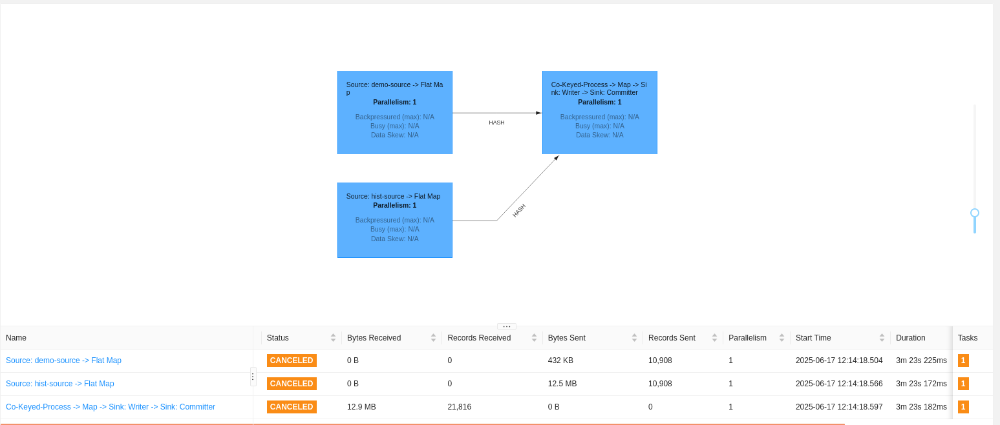
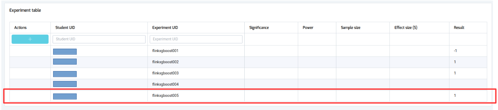

# Flink Streaming Product Category Recommendation

A real-time decision pipeline using Apache Flink for personalized product category display based on historical purchases. Includes model training, PMML deployment, and evaluation via A/B testing.

---

## Project Overview

This project is designed to support targeted product category recommendations in an e-commerce setting. It uses customer demographic and purchase history data to predict whether a specific user should be shown a new product category on the website.

The backend pipeline is built using Apache Flink for real-time streaming decision-making, and the model is trained offline and exported in PMML format for easy deployment into Flink.

---

## Directory Structure

```txt
.
├── model_training/
│   ├── data/                                       # Training/testing data
│   ├── model/                                      # Trained model and evaluation reports
│   ├── train.py                                    # Main training script
│   ├── pyproject.toml
│   └── poetry.lock
├── flink_pipeline/
│   ├── build.sbt                                   # SBT build file
│   └── src/main/scala/.../RecommendationJob.scala  # Flink streaming application (Scala)
├── scripts/                                        # Utility scripts
│   └── run_pipeline.sh                             # Script to launch pipeline
└── README.md                                       # This file
```

---

## Dataset

The data is organized under the `./model_training/data/` directory:

```txt
data/
├── X_train.csv     # Features for training (indexed by customer ID)
├── X_test.csv      # Features for testing
├── y_train.csv     # Labels for training (binary: show category or not)
└── y_test.csv      # Labels for testing
```

Each row corresponds to a customer session with input features like:

- Age
- Gender indicators (`man`, `woman`)
- Purchase counts across many product categories (e.g. `cat17`, `cat42`, etc.)

---

## Model Training

The training code lives in the `model_training/` directory:

```txt
model_training/
├── train.py                               # XGBoost training and PMML export
├── classification_report_xgboost.txt      # Evaluation report for XGBoost
├── classification_report_randomforest.txt # Optional RandomForest report
├── xgboost_model.pmml                     # Exported model for Flink
├── pyproject.toml                         # Poetry config for model training
└── poetry.lock                            # Locked dependencies
```

### Training Methodology

1. Preprocessing is done using `StandardScaler`.
2. The model is trained using `XGBoostClassifier` with `GridSearchCV` to optimize key hyperparameters.
3. The best model is evaluated using accuracy and confusion matrix.
4. The model is exported to PMML format using Nyoka for deployment into Flink.

---

### Model Training Setup and Execution

#### 1. Install dependencies (Poetry required)

Navigate to the `model_training/` directory and install dependencies:

```bash
cd model_training
poetry install
```

This installs Python dependencies listed in `pyproject.toml`, including:

- `xgboost`
- `scikit-learn`
- `nyoka`
- `pandas`

#### 2. Activate virtual environment

```bash
poetry shell
```

#### 3. Run the training script

```bash
python train.py
```

This will:

- Train the model
- Print best hyperparameters
- Save evaluation report to `classification_report_xgboost.txt`
- Export the model to `xgboost_model.pmml`

---

### Model Evaluation

After training, evaluation metrics are saved in `classification_report_xgboost.txt`. This can be used to:

- Validate model performance
- Compare with alternative models like RandomForest (see `classification_report_randomforest.txt`)

---

## Configuring the A/B Test Experiment

To validate the model in production, configure an A/B test at [http://bigdatamaster.dataspartan.com/](http://bigdatamaster.dataspartan.com/)

### Steps to Configure

1. Click the **+** button to create a new experiment.
2. Fill in the fields in the editable row:

   - **Student UID**: Student identification.
   - **Experiment UID**: A unique label.
   - **Significance**: `0.05` (for 95% confidence).
   - **Power**: `0.8` (80% chance of detecting a real effect).
   - **Effect size (\$)**: `0.7` (target uplift set by business).

3. **Compute the required sample size** using the formula below, and enter the value in the **Sample size** field.

$$n = \frac{2\sigma^2}{\tau^2} (z_{\alpha} + z_{\beta})^2$$

Where:

- $\sigma = 15$ (standard deviation)
- $\tau = 0.7$ (effect size)
- $z_{\alpha} = 1.645$ (for 95% confidence)
- $z_{\beta} = 0.84$ (for 80% power)

Plugging in the values:

$$
n = \frac{2 \times 15^2}{0.7^2} \times (1.645 + 0.84)^2 = \frac{2 \times 225}{0.49} \times (2.485)^2 \approx \frac{450}{0.49} \times 6.18 \approx 918.37 \times 6.18 \approx 5677
$$

**Result:** Enter `5677` as the sample size (users per group).

4. Once Confirmed, the platform will generate a **token**. Add this token in all predictions sent to the Kafka topic `topic_student_prediction`:

```json
{ "uuid": 1234567, "value": 1, "token": "TOKEN" }
```

---

## Flink Pipeline

The streaming application consumes demographic and historic purchase data, joins them, applies the PMML model, and publishes predictions in real time.

### Requirements

- Java JDK 8 or higher
- Scala 2.12
- SBT (version 1.5+)
- Apache Flink 1.20
- Apache Kafka cluster (on bigdatamaster.dataspartan.com)
- Environment variables configured in a `.env` file:

  ```dotenv
  BROKERS=bigdatamaster.dataspartan.com:19093,bigdatamaster.dataspartan.com:29093,bigdatamaster.dataspartan.com:39093
  PMML_PATH=/path/to/model/xgboost_model.pmml
  TOKEN=ab_test_token
  DEMO_TOPIC=topic_demographic
  HIST_TOPIC=topic_historic
  OUT_TOPIC=topic_student_prediction
  ```

### Building the Pipeline

Generate a fat JAR using SBT:

```bash
cd flink_pipeline
sbt assembly
```

This produces `target/scala-2.12/flink-streaming-product-category-recommendation-assembly-0.1.0.jar`.

### Running the Pipeline

Use the provided script or run directly with Flink:

```bash
flink run \
    ./target/scala-2.12/flink_recommendation_pipeline.jar \
    --job-name RecommendationJob \
    --detached
```

### Architecture

1. **Kafka Sources**: Two streams (`topic_demographic`, `topic_historic`) ingest user session data.
2. **Parsing**: JSON is deserialized into domain objects (`Demographic`, `Historic`).
3. **Join**: A `KeyedCoProcessFunction` matches records by `uuid`, buffering one side until the other arrives.
4. **Feature Assembly**: Merged into a unified `User` object containing age, gender flags, and historic category counts.
5. **PMML Prediction**: The `PMMLPredictor` loads the XGBoost model and scores incoming feature vectors.
6. **Sink**: Outputs JSON predictions with `uuid`, `value`, and `token` to `topic_student_prediction`.



---

## Experiment Results

The A/B test results are obtained from the platform at [http://bigdatamaster.dataspartan.com/](http://bigdatamaster.dataspartan.com/). The results shows `1` as the experiment has been successful, indicating that the model is effective in predicting whether a user should be shown a new product category.


