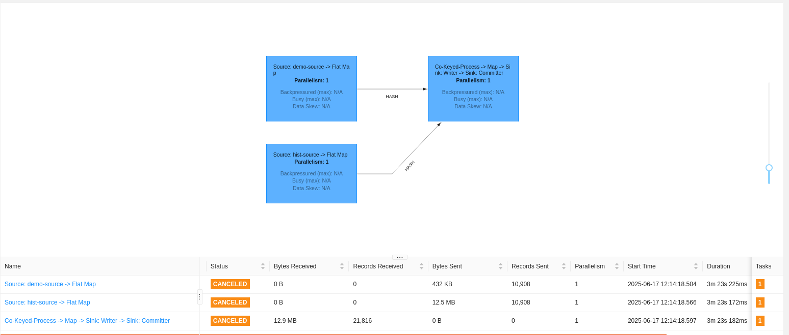
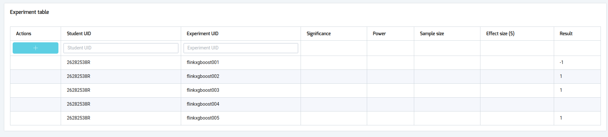

# Recomendación de Categorías de Productos con Flink Streaming

Una pipeline de decisión en tiempo real usando Apache Flink para mostrar categorías de productos personalizadas basadas en compras históricas. Incluye entrenamiento del modelo, despliegue en formato PMML y evaluación mediante test A/B.

---

## Resumen del Proyecto

Este proyecto está diseñado para ofrecer recomendaciones dirigidas de categorías de productos en un entorno de comercio electrónico. Utiliza datos demográficos y de historial de compras de los usuarios para predecir si a un usuario concreto se le debería mostrar una nueva categoría de producto en la web.

La pipeline trasera está construida con Apache Flink para la toma de decisiones en streaming en tiempo real, y el modelo se entrena offline y se exporta en formato PMML para facilitar su despliegue en Flink.

---

## Estructura del Directorio

```txt
.
├── model_training/
│   ├── data/                                       # Datos de entrenamiento/prueba
│   ├── model/                                      # Modelo entrenado e informes de evaluación
│   ├── train.py                                    # Script principal de entrenamiento
│   ├── pyproject.toml
│   └── poetry.lock
├── flink_pipeline/
│   ├── build.sbt                                   # Archivo de construcción SBT
│   └── src/main/scala/.../RecommendationJob.scala  # Aplicación Flink (Scala)
├── scripts/                                        # Scripts de utilidad
│   └── run_pipeline.sh                             # Script para lanzar la pipeline
└── README.md                                       # Este archivo
```

---

## Conjunto de Datos

Los datos están organizados en el directorio `./model_training/data/`:

```txt
data/
├── X_train.csv     # Características para entrenamiento (indexado por ID de usuario)
├── X_test.csv      # Características para prueba
├── y_train.csv     # Etiquetas para entrenamiento (binario: mostrar categoría o no)
└── y_test.csv      # Etiquetas para prueba
```

Cada fila corresponde a una sesión de usuario con características de entrada como:

- Edad
- Indicadores de género (`man`, `woman`)
- Número de compras en distintas categorías de productos (por ejemplo, `cat17`, `cat42`, etc.)

---

## Entrenamiento del Modelo

El código de entrenamiento se encuentra en el directorio `model_training/`:

```txt
model_training/
├── train.py                               # Entrenamiento con XGBoost y exportación a PMML
├── classification_report_xgboost.txt      # Informe de evaluación para XGBoost
├── classification_report_randomforest.txt # Informe opcional para RandomForest
├── xgboost_model.pmml                     # Modelo exportado para Flink
├── pyproject.toml                         # Configuración de Poetry para dependencias
└── poetry.lock                            # Dependencias bloqueadas
```

### Metodología de Entrenamiento

1. Se realiza la preprocesamiento usando `StandardScaler`.
2. Se entrena el modelo `XGBoostClassifier` utilizando `GridSearchCV` para optimizar hiperparámetros clave.
3. El mejor modelo se evalúa mediante precisión y matriz de confusión.
4. El modelo se exporta en formato PMML usando Nyoka para su despliegue en Flink.

---

### Configuración y Ejecución del Entrenamiento

#### 1. Instalar dependencias (se requiere Poetry)

Ve al directorio `model_training/` e instala las dependencias:

```bash
cd model_training
poetry install
```

Esto instalará las dependencias de Python indicadas en `pyproject.toml`, incluyendo:

- `xgboost`
- `scikit-learn`
- `nyoka`
- `pandas`

#### 2. Activar el entorno virtual

```bash
poetry shell
```

#### 3. Ejecutar el script de entrenamiento

```bash
python train.py
```

Esto:

- Entrenará el modelo
- Imprimirá los mejores hiperparámetros
- Guardará el informe en `classification_report_xgboost.txt`
- Exportará el modelo a `xgboost_model.pmml`

---

### Evaluación del Modelo

Tras el entrenamiento, las métricas de evaluación se guardan en `classification_report_xgboost.txt`. Esto permite:

- Validar el rendimiento del modelo
- Compararlo con modelos alternativos como RandomForest (`classification_report_randomforest.txt`)

---

## Configuración del Experimento A/B

Para validar el modelo en producción, configura un test A/B en [http://bigdatamaster.dataspartan.com/](http://bigdatamaster.dataspartan.com/)

### Pasos para Configurar

1. Pulsa el botón **+** para crear un nuevo experimento.

2. Rellena los campos en la fila editable:

   - **Student UID**: Identificación del estudiante.
   - **Experiment UID**: Etiqueta única.
   - **Significance**: `0.05` (para 95% de confianza).
   - **Power**: `0.8` (80% de probabilidad de detectar un efecto real).
   - **Effect size (\$)**: `0.7` (incremento esperado).

3. **Calcula el tamaño muestral requerido** usando la siguiente fórmula y escribe el valor en el campo **Sample size**:

$$n = \frac{2\sigma^2}{\tau^2} (z_{\alpha} + z_{\beta})^2$$

Donde:

- $\sigma = 15$ (desviación estándar)
- $\tau = 0.7$ (tamaño del efecto)
- $z_{\alpha} = 1.645$ (para 95% de confianza)
- $z_{\beta} = 0.84$ (para 80% de potencia)

Sustituyendo:

$$
n = \frac{2 \times 15^2}{0.7^2} \times (1.645 + 0.84)^2 = \frac{2 \times 225}{0.49} \times (2.485)^2 \approx \frac{450}{0.49} \times 6.18 \approx 918.37 \times 6.18 \approx 5677
$$

**Resultado:** Introduce `5677` como tamaño muestral (usuarios por grupo).

4. Una vez confirmado, la plataforma generará un **token**. Incluye ese token en todas las predicciones enviadas al topic Kafka `topic_student_prediction`:

```json
{ "uuid": 1234567, "value": 1, "token": "TOKEN" }
```

---

## Pipeline Flink

La aplicación de streaming consume datos demográficos e históricos de compra, los une, aplica el modelo PMML y publica predicciones en tiempo real.

### Requisitos

- Java JDK 8 o superior
- Scala 2.12
- SBT (versión 1.5+)
- Apache Flink 1.20
- Cluster Apache Kafka (en bigdatamaster.dataspartan.com)
- Variables de entorno definidas en un archivo `.env`:

```dotenv
BROKERS=bigdatamaster.dataspartan.com:19093,bigdatamaster.dataspartan.com:29093,bigdatamaster.dataspartan.com:39093
PMML_PATH=/path/to/model/xgboost_model.pmml
TOKEN=ab_test_token
DEMO_TOPIC=topic_demographic
HIST_TOPIC=topic_historic
OUT_TOPIC=topic_student_prediction
```

### Compilar la Pipeline

Genera el JAR ejecutable con SBT:

```bash
cd flink_pipeline
sbt assembly
```

Esto producirá `target/scala-2.12/flink-streaming-product-category-recommendation-assembly-0.1.0.jar`.

### Ejecutar la Pipeline

Usa el script proporcionado o ejecuta directamente con Flink:

```bash
flink run \
    ./target/scala-2.12/flink_recommendation_pipeline.jar \
    --job-name RecommendationJob \
    --detached
```

### Arquitectura

1. **Fuentes Kafka**: Dos flujos (`topic_demographic`, `topic_historic`) con datos de sesiones.
2. **Parseo**: El JSON se deserializa a objetos (`Demographic`, `Historic`).
3. **Join**: Un `KeyedCoProcessFunction` empareja registros por `uuid`, almacenando en buffer hasta que lleguen ambos.
4. **Construcción de Características**: Se unifican en un objeto `User` con edad, género y compras.
5. **Predicción PMML**: `PMMLPredictor` carga el modelo y puntúa vectores entrantes.
6. **Sink**: Publica predicciones JSON con `uuid`, `value` y `token` en `topic_student_prediction`.



---

## Resultados del Experimento

Los resultados del test A/B se obtienen desde la plataforma [http://bigdatamaster.dataspartan.com/](http://bigdatamaster.dataspartan.com/). El resultado `1` indica que el experimento fue exitoso y que el modelo es eficaz para predecir si se debe mostrar una nueva categoría a un usuario.


